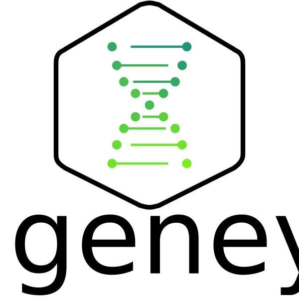

[![License: MIT][license_badge]][license_link]
[![Contributor Covenant][coc_badge]](CODE-OF-CONDUCT.md)

> De Bruijn graph-based De Novo genome assembly CLI tool

## Table of Contents

-   [Install](#install)
    -   [Dependencies](#dependencies)
-   [Usage](#usage)
    -   [Options](#options)
    -   [Examples](#examples)
-   [Maintainers](#maintainers)
-   [Contributing](#contributing)
    -   [Contributors](#contributors)
-   [License](#license)

## Install

Please, visit the [releases page][releases_link] to download the tool. 

## Dependencies
> To be defined later

## Usage
> To be defined later

### Options
> To be defined later

### Examples
> To be defined later

## Maintainers
-   [Denis Verkhoturov](https://github.com/DenisVerkhoturov)
-   [Iana Kabakova](https://github.com/IanaKabakova)

## Contributing
[Issues](issues) and [pull-requests](pulls) are appreciated, thank you for paying attention to project `geney`!
Please take a look at our [code of conduct](CODE-OF-CONDUCT.md) and [contributing guide](CONTRIBUTING.md).

### Contributors
-   [Aleksandra Prohorova](https://github.com/AleksandraProhorova)
-   [Artur Nurtdinov](https://github.com/ArturNurtdinov)
-   [Denis Verkhoturov](https://github.com/DenisVerkhoturov)
-   [Iana Kabakova](https://github.com/IanaKabakova)
-   [Sergey Kozhin](https://github.com/SergeyKozhin)

## License
This project is licenced under the terms of the [MIT](LICENSE.md) license.

[license_link]: https://opensource.org/licenses/MIT
[license_badge]: https://img.shields.io/badge/License-MIT-blue.svg
[coc_badge]: https://img.shields.io/badge/Contributor%20Covenant-v2.0%20adopted-ff69b4.svg
[releases_link]: https://github.com/DenisVerkhoturov/geney/releases
